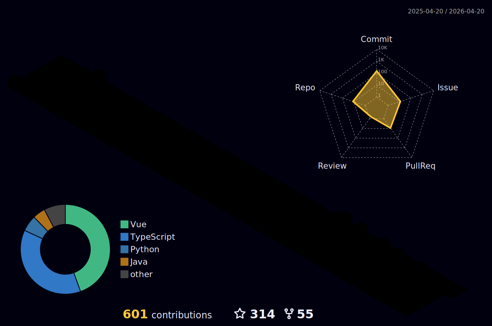

    

## 👋 关于我 About Me

- 🌱 我正在学习 ...
- 💡 我对 ... 特别感兴趣
- 🎯 2024年目标: ...
- ⚡ 有趣的事实: ...

## 🔧 技术栈 Tech Stack

## 📊 GitHub 统计 Stats

    
    

## 🌟 活动图表 Activity Graph

## 🎨 3D 贡献图 3D Contribution

## 🐍 贡献图 Contribution Graph

<picture>
  <source media="(prefers-color-scheme: dark)" srcset="output/github-snake-dark.svg" />
  <source media="(prefers-color-scheme: light)" srcset="output/github-snake.svg" />
  
</picture>

## 📫 联系我 Contact Me

[在这里添加你的社交媒体链接]

---

    

